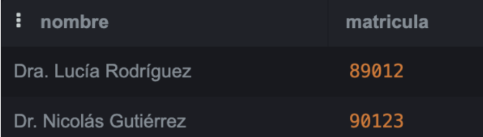
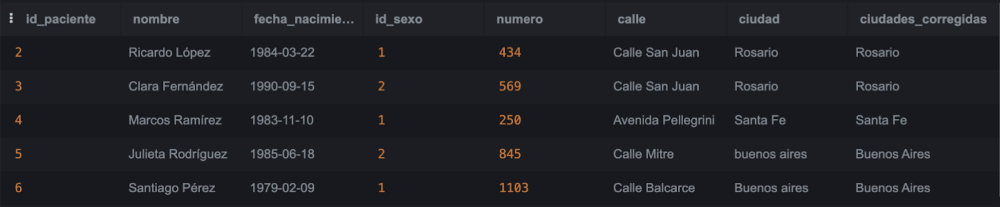
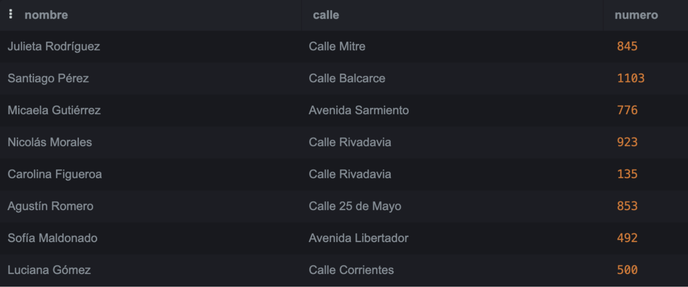
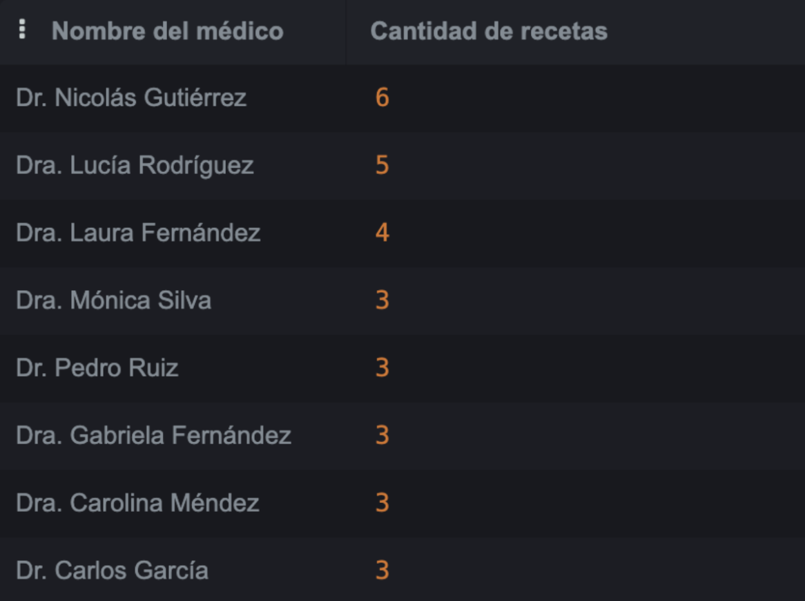
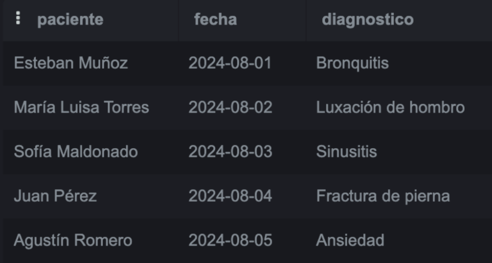
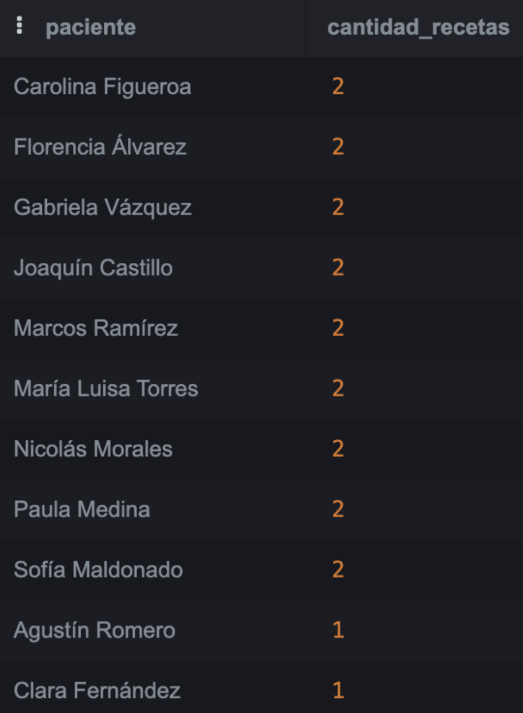
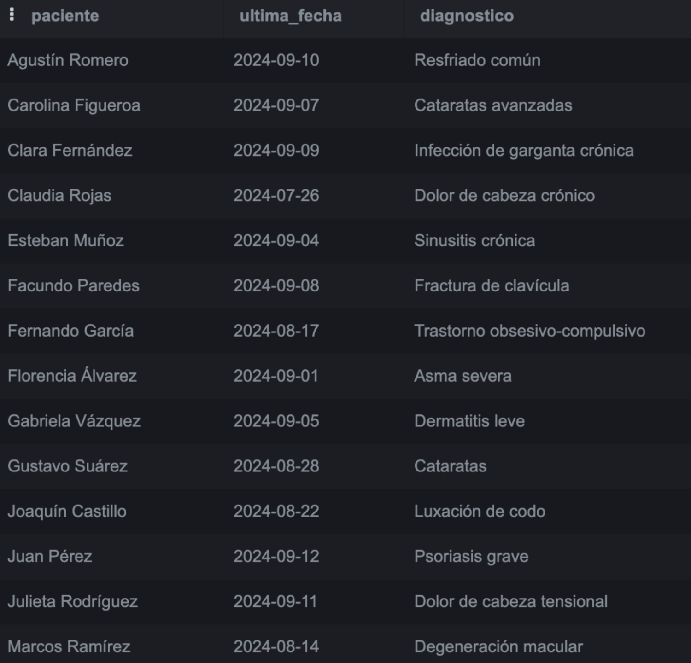
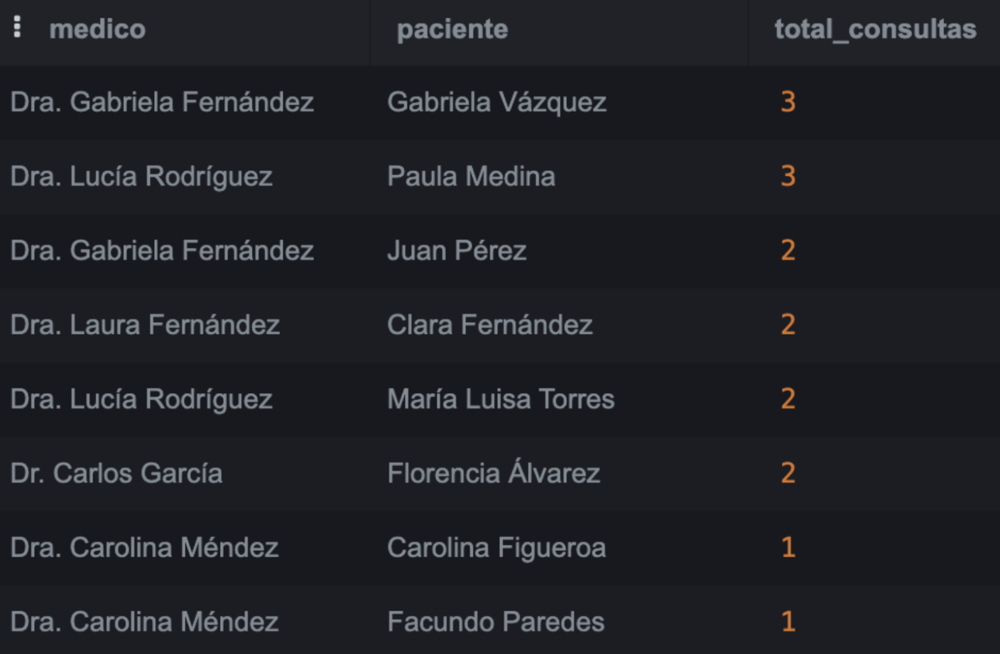
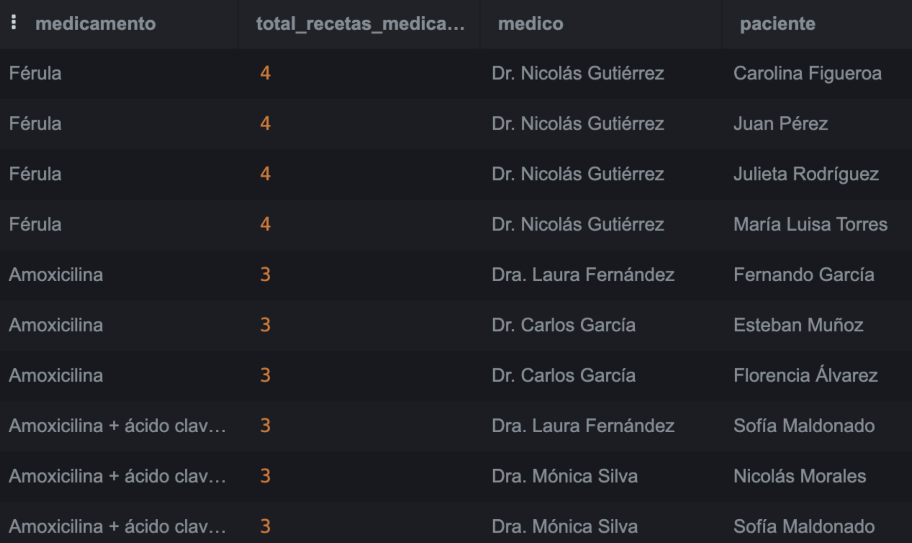
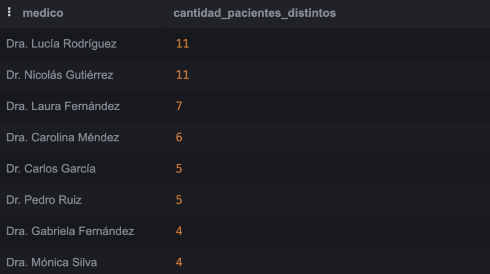

### _16.22 Informática Médica_

<p align="center">
  
</p>

# Trabajo Práctico N°4: Bases de Datos + Manejo de Versiones

## Grupo 5
## Integrantes
* Bassani, Nicolás (63311)
* González, Mateo Ezequiel (63396)
* Menendez Cortona, Paloma (63070)

## **Parte 1:** Base de Datos

### 1. ¿Qué tipo de base de datos es?
 Respuesta

### 2. Armar el diagrama entidad-relación de la base de datos dada.

### 3. Armar el Modelo relacional de la base de datos dada.

### 4. Considera que la base de datos está normalizada. En caso que no lo esté, ¿cómo podría hacerlo?

## **PARTE 2:** SQL

### 1. Cuando se realizan consultas sobre la tabla paciente agrupando por ciudad los tiempos de respuesta son demasiado largos. Proponer mediante una query SQL una solución a este problema.

```
create index idx_pacientes_ciudad 
on Pacientes(ciudad);
```


### 2. Se tiene la fecha de nacimiento de los pacientes. Se desea calcular la edad de los pacientes y almacenarla de forma dinámica en el sistema ya que es un valor típicamente consultado, junto con otra información relevante del paciente.

```
create or replace View PacientesConEdad AS
select
	id_paciente,
    nombre,
    fecha_nacimiento,
    DATE_PART('year', AGE(CURRENT_DATE, fecha_nacimiento))::INT AS edad,
    numero, calle, ciudad, id_sexo
    from pacientes;
```


### 3. La paciente, “Luciana Gómez”, ha cambiado de dirección. Antes vivía en “Avenida Las Heras 121” en “Buenos Aires”, pero ahora vive en “Calle Corrientes 500” en “Buenos Aires”. Actualizar la dirección de este paciente en la base de datos.
```
update pacientes
set calle='Calle Corrientes', numero=500
where id_paciente=1;
```


### 4. Seleccionar el nombre y la matrícula de cada médico cuya especialidad sea identificada por el id 4.
```
select nombre, matricula
from medicos
where especialidad_id=4;
```


### 5. Puede pasar que haya inconsistencias en la forma en la que están escritos los nombres de las ciudades, ¿cómo se corrige esto? Agregar la query correspondiente.
```
select *, CASE
when lower (SUBSTRING(trim(ciudad),1,1)) = 'b' then 'Buenos Aires'
when lower (SUBSTRING(trim(ciudad),1,1)) = 'c' then 'Córdoba'
when lower (SUBSTRING(trim(ciudad),1,1)) = 'm' then 'Mendoza'
when lower (SUBSTRING(trim(ciudad),1,1)) = 's' then 'Santa Fe'
else 'Rosario'
end as ciudades_corregidas
from pacientes;

update pacientes set ciudad=case 
when lower (SUBSTRING(trim(ciudad),1,1)) = 'b' then 'Buenos Aires'
when lower (SUBSTRING(trim(ciudad),1,1)) = 'c' then 'Córdoba'
when lower (SUBSTRING(trim(ciudad),1,1)) = 'm' then 'Mendoza'
when lower (SUBSTRING(trim(ciudad),1,1)) = 's' then 'Santa Fe'
else 'Rosario'
end;
```


### 6. Obtener el nombre y la dirección de los pacientes que viven en Buenos Aires.
```
select nombre, calle, numero 
from pacientes 
where ciudad='Buenos Aires';
```


### 7. Cantidad de pacientes que viven en cada ciudad.
```
SELECT ciudad, COUNT(id_paciente) AS "Cantidad de pacientes"
FROM Pacientes
GROUP BY ciudad;
```


### 8. Cantidad de pacientes por sexo que viven en cada ciudad.
```
SELECT 
    p.ciudad,
    s.descripcion AS sexo,
    COUNT(p.id_paciente) AS cantidad_pacientes
FROM Pacientes p
JOIN SexoBiologico s ON p.id_sexo = s.id_sexo
GROUP BY p.ciudad, s.descripcion
ORDER BY p.ciudad, s.descripcion;
```


### 9. Obtener la cantidad de recetas emitidas por cada médico.
```
SELECT 
    m.nombre AS "Nombre del médico",
    COUNT(r.id_receta) AS "Cantidad de recetas"
FROM Recetas r          -- r = Recetas
JOIN Medicos m          -- m = Medicos
    ON m.id_medico = r.id_medico
GROUP BY m.nombre
ORDER BY "Cantidad de recetas" DESC;
```


### 10. Obtener todas las consultas médicas realizadas por el médico con ID igual a 3 durante el mes de agosto de 2024.
```
SELECT *
FROM Consultas
WHERE id_medico = 3
  AND fecha >= '2024-08-01'
  AND fecha < '2024-09-01'
ORDER BY fecha;
```


### 11. Obtener el nombre de los pacientes junto con la fecha y el diagnóstico de todas las consultas médicas realizadas en agosto del 2024.
```
SELECT 
    p.nombre AS paciente,
    c.fecha,
    c.diagnostico
FROM Consultas c
JOIN Pacientes p ON p.id_paciente = c.id_paciente
WHERE c.fecha >= '2024-08-01'
  AND c.fecha < '2024-09-01'
ORDER BY c.fecha;
```


### 12. Obtener el nombre de los medicamentos prescritos más de una vez por el médico con ID igual a 2.
```
SELECT
  med.nombre AS medicamento,
  COUNT(*)   AS veces_prescripto
FROM Recetas r
JOIN Medicamentos med
  ON med.id_medicamento = r.id_medicamento
WHERE r.id_medico = 2
GROUP BY med.nombre
HAVING COUNT(*) > 1
ORDER BY veces_prescripto DESC, med.nombre;
```


### 13. Obtener el nombre de los pacientes junto con la cantidad total de recetas que han recibido.
```
SELECT
  p.nombre AS paciente,
  COUNT(r.id_receta) AS cantidad_recetas
FROM Pacientes p
LEFT JOIN Recetas r
  ON r.id_paciente = p.id_paciente
GROUP BY p.nombre
ORDER BY cantidad_recetas DESC, p.nombre;
```


### 14. Obtener el nombre del medicamento más recetado junto con la cantidad de recetas emitidas para ese medicamento.
```
SELECT 
  med.nombre AS medicamento,
  COUNT(*)   AS total_recetas
FROM Recetas r
JOIN Medicamentos med ON med.id_medicamento = r.id_medicamento
GROUP BY med.nombre
ORDER BY total_recetas DESC, med.nombre
FETCH FIRST 1 ROW WITH TIES;
```


### 15. Obtener el nombre del paciente junto con la fecha de su última consulta y el diagnóstico asociado.
```
SELECT
  p.nombre AS paciente,
  c.fecha  AS ultima_fecha,
  c.diagnostico
FROM Pacientes p
JOIN (
  SELECT id_paciente, MAX(fecha) AS max_fecha
  FROM Consultas
  GROUP BY id_paciente
) m ON m.id_paciente = p.id_paciente
JOIN Consultas c
  ON c.id_paciente = m.id_paciente
 AND c.fecha       = m.max_fecha
ORDER BY p.nombre;
```


### 16. Obtener el nombre del médico junto con el nombre del paciente y el número total de consultas realizadas por cada médico para cada paciente, ordenado por médico y paciente.
```
SELECT 
  m.nombre   AS medico,
  p.nombre   AS paciente,
  COUNT(*)   AS total_consultas
FROM Consultas c
JOIN Medicos   m ON m.id_medico   = c.id_medico
JOIN Pacientes p ON p.id_paciente = c.id_paciente
GROUP BY m.nombre, p.nombre
ORDER BY total_consultas DESC, m.nombre, p.nombre;
```


### 17. Obtener el nombre del medicamento junto con el total de recetas prescritas para ese medicamento, el nombre del médico que lo recetó y el nombre del paciente al que se le recetó, ordenado por total de recetas en orden descendente.
```
SELECT
  med.nombre AS medicamento,
  t.total_recetas_medicamento,
  m.nombre   AS medico,
  p.nombre   AS paciente
FROM Recetas r
JOIN Medicamentos med ON med.id_medicamento = r.id_medicamento
JOIN Medicos      m   ON m.id_medico       = r.id_medico
JOIN Pacientes    p   ON p.id_paciente     = r.id_paciente
JOIN (
  SELECT r2.id_medicamento, COUNT(*) AS total_recetas_medicamento
  FROM Recetas r2
  GROUP BY r2.id_medicamento
) t ON t.id_medicamento = r.id_medicamento
ORDER BY t.total_recetas_medicamento DESC, med.nombre, m.nombre, p.nombre
```


### 18. Obtener el nombre del médico junto con el total de pacientes a los que ha atendido, ordenado por el total de pacientes en orden descendente.
```
SELECT
  m.nombre AS medico,
  COUNT(DISTINCT c.id_paciente) AS cantidad_pacientes_distintos
FROM Consultas c
JOIN Medicos m ON m.id_medico = c.id_medico
GROUP BY m.nombre
ORDER BY cantidad_pacientes_distintos DESC, m.nombre;
```

